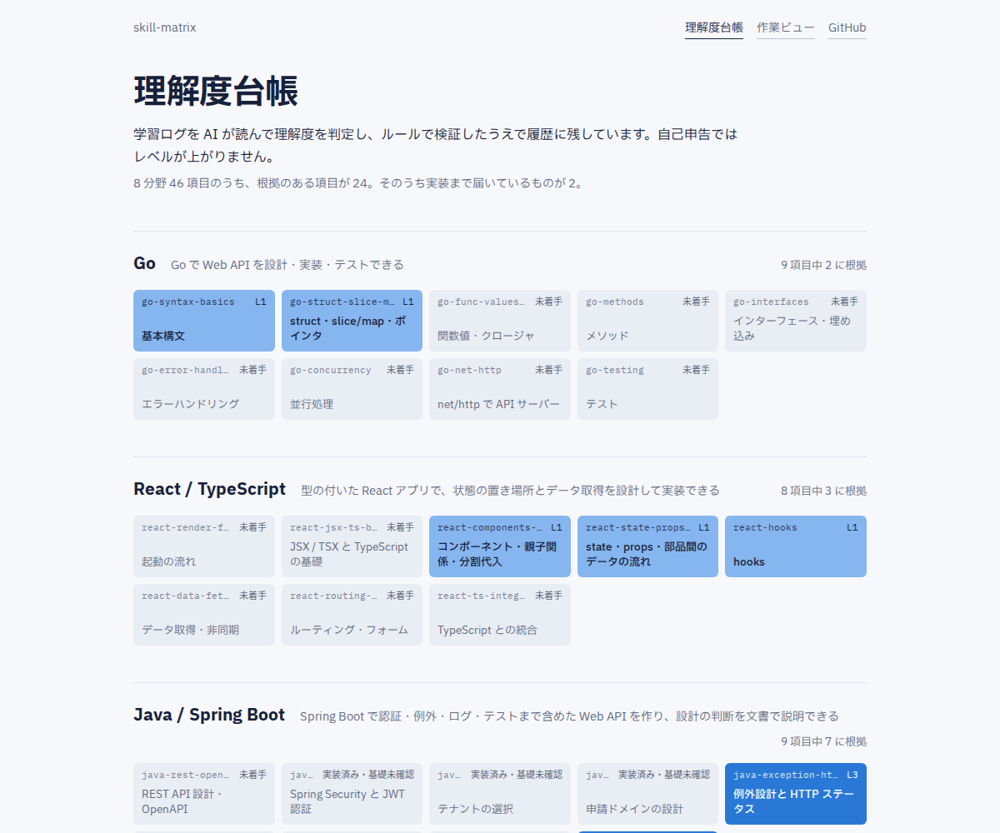
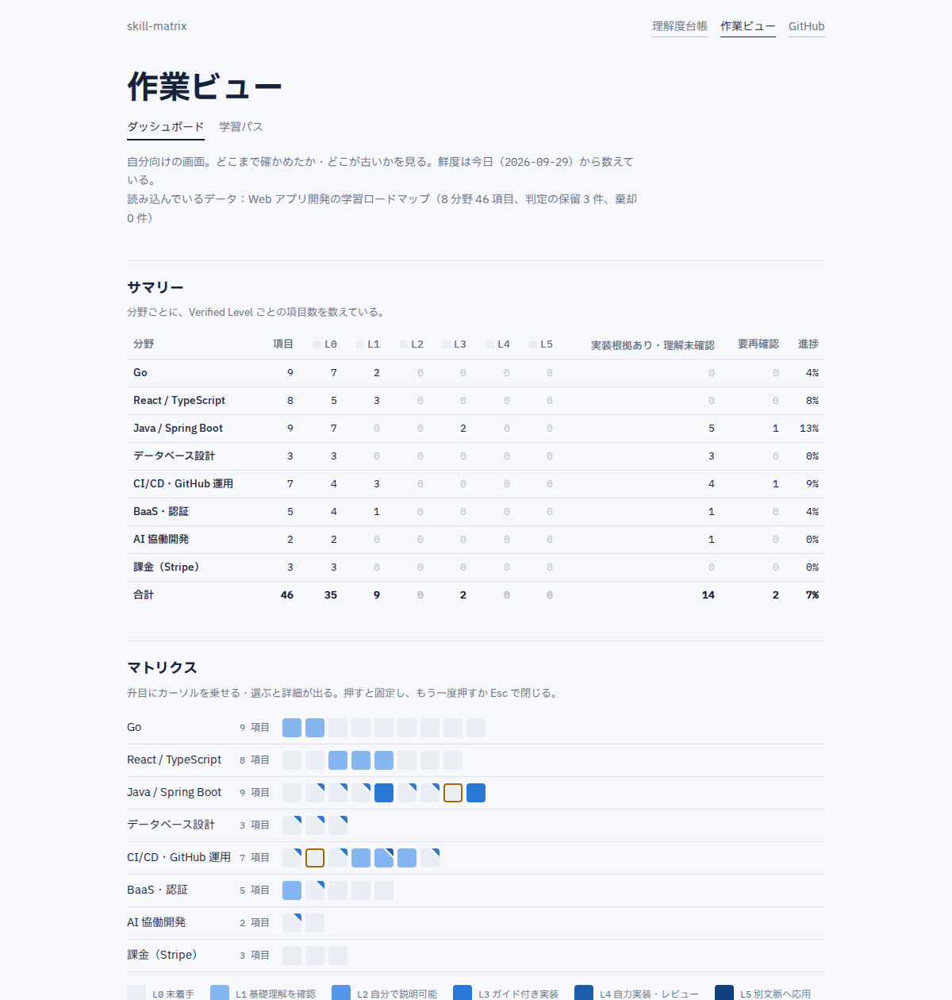
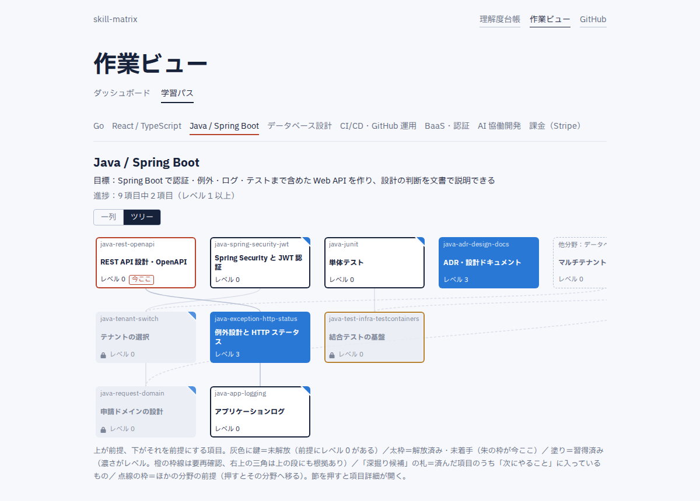

# skill-matrix

学習ログを AI（Claude Code / ChatGPT）に読ませて理解度を判定させ、ロードマップの「分野 × 詳細項目」の理解度マトリクスと学習パスを静的サイトで見るツール。

チェックボックスを自分で付けるのではなく、「今日やったこと・理解したこと」を学習ログに書き、AI が根拠付きで判定する。
判定はルールで機械的に検査してから履歴に残すので、自己申告だけでは理解度は上がらない。

公開中の画面：https://n-yoshida-dev.github.io/skill-matrix/



## 仕組み

```
学習ログ（Markdown）
   │  Claude Code の /judge-log、または ChatGPT に prompts/judge.md を渡す
   ▼
判定ファイル data/judgments/*.json（追記のみ）
   │  CLI の recalc：形の検査 → 検証ルール V1〜V8 → 適用
   ▼
理解度 data/state.json（CLI だけが書く。CI の verify が一致を確かめる）
   │  ビルド時に取り込む（サーバ通信なし）
   ▼
画面（静的サイト）：公開ビュー #/ と 作業ビュー #/plan
```

- 理解度は 0〜5 の 6 段。「印」（どの段の根拠があるか）から、1 から途切れずに印が付いている最上段を Verified Level とする。
  実装の根拠（3）は基礎理解（1・2）を含意しない。詳しくは [docs/spec-guide.md](docs/spec-guide.md)
- 判定の基準は `data/roadmap.json` の `levels`、根拠の種類ごとに付けられる段は `backend/internal/domain/types.go` の 1 か所にだけ書いてある

## 必要なもの

- Node.js 24（画面）
- Go 1.26.4 以上（`backend/go.mod` のとおり。判定の検査と `state.json` の再計算をする CLI）
- 判定させる AI：Claude Code（`/judge-log` が使える）、ファイルを読めるほかのエージェント（Codex CLI など）、ファイルを貼り付けられるチャット（ChatGPT など）のどれか

## 一周する（学習ログ → 判定 → 画面）

### 1. 取得して画面を開く

```bash
git clone https://github.com/n-yoshida-dev/skill-matrix.git
cd skill-matrix/frontend
npm ci
npm run dev
```

http://localhost:5173/#/ が公開ビュー、http://localhost:5173/#/plan が作業ビュー。最初は `data/` に入っている作者のデータが見える。
`npm run dev` はターミナルを占有したまま動き続けるので、手順 2 からは**別のターミナルを開き、リポジトリ直下（`skill-matrix/`）で**進める。

自分用に使うなら、先に下の「[自分のロードマップにする](#自分のロードマップにする)」で作者の判定を外しておく（そのまま進むと、自分の判定が作者の理解度に混ざる）。
一周を試すだけなら、このまま進んでよい。

### 2. 学習ログの置き場を決める

リポジトリ直下で：

```bash
cp sources.local.json.example sources.local.json
mkdir -p learning-logs
```

`sources.local.json` と `learning-logs/` はコミットしない（`.gitignore` 済み）。置き場は 2 通り書ける。

- `logs.path`：このリポジトリの中のコミットしない置き場（既定 `learning-logs/`）。ここに `YYYY-MM-DD.md` を置く
- `repos`：学習ログを別のリポジトリに書いているなら、その場所（`path`）とログのパターン（`logsGlob`）。判定は**コミット済み**のログだけを読む。
  例に入っている `repos` は作者の学習リポジトリなので、使わないなら `repos` のキーごと消す（`logs` だけ残す）

学習ログの形は自由。何をやったか・自分の言葉で何を説明できたか・どんな確認問題に答えたか・何を作ったかが書いてあれば、判定の根拠になる。

### 3. AI に判定させる

判定の基準・禁止事項・出力の形・手順はすべて [prompts/judge.md](prompts/judge.md) にある。使う AI によって入口が違う。

- **Claude Code なら**、リポジトリ直下で次を実行する。未判定のログを古い順に 1 件選び、`data/judgments/` に判定ファイルを 1 つ書く

  ```
  /judge-log                    # 未判定のログを 1 件探して判定する
  /judge-log <ログのパス>        # ファイルを指定して判定する
  ```

- **ファイルを読めるほかのエージェント（Codex CLI など）なら**、`prompts/judge.md` を読ませ、その「手順」どおりに進めさせる。判定ファイルを 1 つ書くところまで自分で進む（ただし Codex CLI などでの実機確認はまだしていない）
- **ChatGPT などファイルを読めない AI なら**、`prompts/judge.md` の本文と、その末尾「チャットに貼って使う場合」に並んでいるファイル（ロードマップ・設定・理解度・学習ログなど）を貼り付ける。
  返ってきた JSON を、AI が添えたファイル名で `data/judgments/` に保存する（名前の先頭は判定を書いた日、続けてログの日付と題材。英小文字・数字・ハイフンだけ）

`rationale` と `evidenceRefs` には技術的な事実だけを書かせる（判定ファイルはコミットされ、公開される）。

### 4. 検査して理解度を作り直す

リポジトリ直下で：

```bash
go -C backend run ./cmd/skillmatrix recalc --data ../data
```

判定を検査して `data/state.json` を書き直し、「変わった項目」・保留（確信度が低いなど）・棄却を表示する。
クローン直後は作者の判定の保留も毎回出るので、自分の判定ファイル名の行と「変わった項目」を見る。
棄却が出たら判定ファイルを直す。保留は適用されず、人が採否を決める（採用するなら `source: "manual"` の判定ファイルを足す）。

新しい判定ファイルはまだ git に追跡されていないので、そのままの `git diff` には出ない（出るのは `state.json` の差分だけ）。`git status` で新しいファイルを確かめて開くか、
`git add -N data/judgments/<ファイル>`（中身は入れずに「追跡する予定」とだけ登録する）のあと `git diff` で、`rationale` と `evidenceRefs` を読む。
納得したら、判定ファイルと `state.json` を一緒にコミットする。
コミット後の訂正は、既存のファイルを直さずに新しい判定ファイルを足す。

### 5. 画面で見る

`npm run dev` を開いたままなら、`data/` の JSON が変わると画面が自動で作り直される。`npm run build` した画面は、ビルドし直すまで変わらない（データはビルド時に取り込み、画面はサーバと通信しない）。

| 画面 | 見るもの |
|---|---|
| 公開ビュー `#/` | 初めて見る人向け。分野ごとのタイルと、押すと出る根拠 |
| 作業ビュー `#/plan` | サマリー帯（分野 × レベルの項目数）・マトリクス（塗り＝レベル、橙の枠線＝要再確認、右上の三角＝上の段にも根拠）・次にやること Top 5 |
| 学習パス `#/plan/path/<分野>` | 依存順の一列表示と、前提が上・派生が下のスキルツリー表示（切り替えは記憶される） |
| 項目詳細 `#/plan/item/<項目キー>` | Verified Level・付いている印・未確認の段、印の履歴と根拠、保留 |

判定が効いたかは、判定した項目の `#/plan/item/<項目キー>` を開き、印と履歴が増えたかで確かめる。





## GitHub Pages で公開する

`main` に入ると `.github/workflows/pages.yml` が画面をビルドし、GitHub Pages に上げる。最初に一度だけ、リポジトリの Settings → Pages → Source を「GitHub Actions」にする。
それまではビルドだけして公開を飛ばす（ワークフローは緑のまま）。

公開すると `data/judgments/` の `rationale` と `evidenceRefs` も誰でも読める。Public にする前に全件を目で読み、所属先・企業名・人名などの固有名詞が混ざっていないことを確かめる。

## 自分のロードマップにする

`data/roadmap.json` を自分のロードマップに書き換え、`data/judgments/` を空に、`data/state.json` を `recalc` で作り直す。
形は `SPEC.md` §2。外部のロードマップ（roadmap.sh など）を元にするなら（`origin: "external"`）、出典（`source`）と確認日（`checkedAt`）を書く。
`verifyBy` にはその項目で次の段を確かめる方法を書き、印が付いて段が上がったら次の段の方法に書き換える（`data/README.md`）。

画面のヘッダーとフッターは `data/settings.json` の `site.repoUrl` のリポジトリを指す。自分のリポジトリの URL に変える（変えないと作者のリポジトリへのリンクのまま公開される）。

## 開発

どれもリポジトリ直下で 1 行ずつ打つ（括弧の中だけ `frontend/` に移る）。

```bash
# 画面（CI と同じ検査）
(cd frontend && npm run format:check && npm run lint && npm run typecheck && npm test && npm run build)
# E2E（ビルドした画面で、JSON を差し替えると表示が変わることを確かめる）
(cd frontend && npx playwright install chromium && npm run e2e)

# 判定の検査・再計算の CLI と単体テスト
go -C backend test ./internal/... ./cmd/skillmatrix
go -C backend run ./cmd/skillmatrix verify --data ../data   # CI と同じ（書き出さない）
go -C backend run ./cmd/skillmatrix refs <判定ファイル名>     # 根拠の指す学習ログの行を出す（手元だけ。sources.local.json が要る）
```

`backend/` のサーバ・DB・非同期判定のコードは、他人にも使わせる版（v2）のために棚上げしてある（`SPEC.md` §10）。v1 では使わない。

## ドキュメント

- 仕様の解説（人間向け）：[docs/spec-guide.md](docs/spec-guide.md)
- 開発ドキュメント（AI 向け）：`PLAN.md`（何を・なぜ）／`SPEC.md`（確定した仕様）／`TODO.md`／`KNOWLEDGE.md`／`HANDOFF.md`
- データの置き方：[data/README.md](data/README.md)

## ライセンス

未定。公開時に決める。
